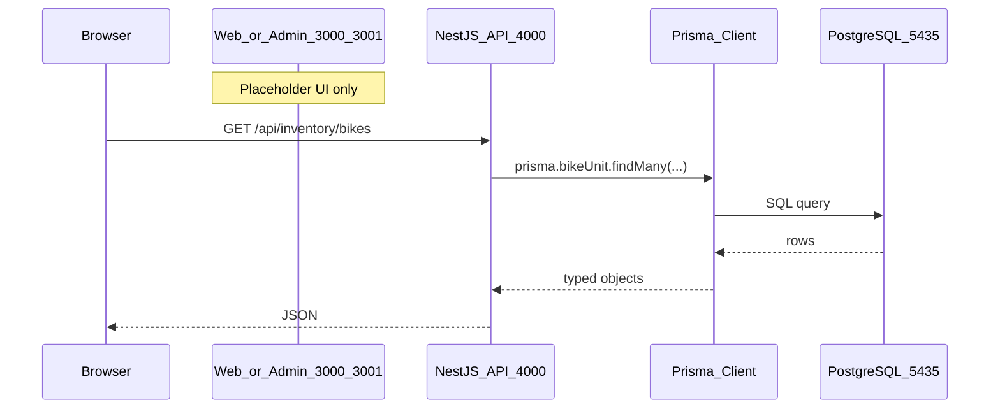
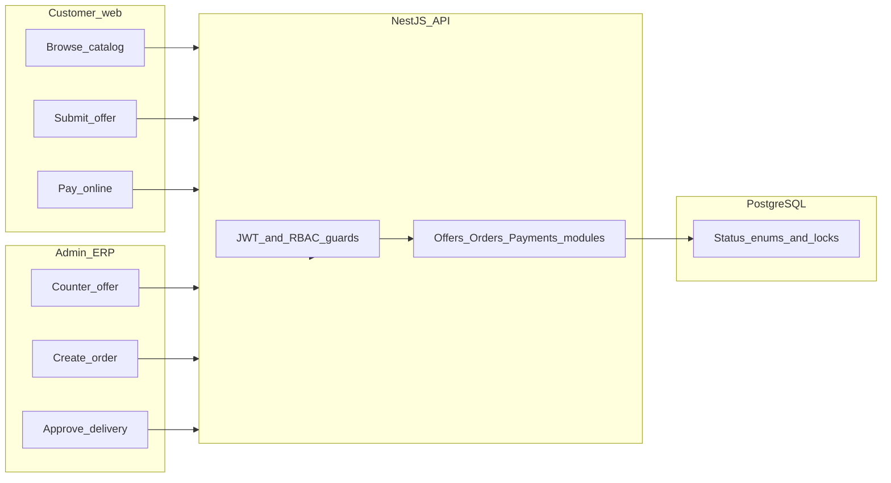

# Khan Enterprises — Full Project Explained

A plain-language guide to the monorepo layout, how requests flow, database design, business workflow, and what is built vs. planned. Use this before diving into code.

---

## The one-sentence version

You are building **digital infrastructure for a multi-branch motorcycle dealership**: customers browse and negotiate online, staff run operations from an admin dashboard, and one backend API enforces business rules while PostgreSQL remembers everything.

---

## Master analogy: a dealership campus

Think of the whole repo as **one company campus** with three customer-facing buildings and one shared records vault:

| Real-world piece | Code equivalent | Port (local) |
|------------------|-----------------|--------------|
| **Showroom** (public) | [`apps/web`](../apps/web) — customer Next.js site | 3000 |
| **Back office** (staff only) | [`apps/admin`](../apps/admin) — ERP Next.js dashboard | 3001 |
| **Reception / operations desk** (rules & processing) | [`apps/api`](../apps/api) — NestJS REST API | 4000 |
| **Company filing room** (permanent records) | PostgreSQL in Docker | 5435 |
| **Blueprint of every form** | [`packages/prisma/schema.prisma`](../packages/prisma/schema.prisma) | — |

Right now the **showroom and back office are empty shells** (default Next.js placeholder pages). The **operations desk is partially staffed** (auth check, user list, inventory reads, branches). The **filing room is fully designed and stocked with sample data** (migrations + seed).

---

## Monorepo = one warehouse, many departments

The repo uses **npm workspaces + Turborepo** ([`package.json`](../package.json), [`turbo.json`](../turbo.json)).

**Analogy:** One landlord (root `package.json`) rents space to several tenants (`apps/*`, `packages/*`). Turborepo is the **building manager** — when you run `npm run dev`, it starts dev servers in parallel; when you build, it respects dependencies (e.g. generate Prisma client before building API).

```
khan-enterprises/          ← the campus
├── apps/web               ← showroom (not built yet)
├── apps/admin             ← back office (not built yet)
├── apps/api               ← operations desk (partially built)
├── packages/prisma        ← shared “form templates” + DB client
├── docker/                ← on-site power + water (Postgres + pgAdmin)
└── docs/                  ← runbooks (Sprint 1 guide is the best source)
```

Shared packages `ui`, `types`, `utils` are mentioned in the README but **do not exist yet** — only `@khan/prisma` is real today.

---

## How a request flows (today vs. future)

### Today (what actually runs)



**Analogy:** A customer could call the operations desk on the phone (curl/Postman) and ask “what bikes do you have?” — but there is no polished storefront window yet.

Implemented routes (from [sprint1_finalized.md](./sprint1_finalized.md)):

| Area | Routes | Role |
|------|--------|------|
| Auth | `GET /api/auth/check?email=`, `GET /api/auth/users` | Lookup staff by email; list users |
| Inventory | `GET /api/inventory/bikes`, `GET /api/inventory/parts` | Read bikes/parts (optional `branchId`) |
| Branches | `GET /api/branches`, `GET /api/branches/:id` | List branches + counts |

NestJS structure ([`apps/api/src/app.module.ts`](../apps/api/src/app.module.ts)): each feature is a **module** (Auth, Inventory, Branch) with a **controller** (HTTP doors) and **service** (business logic). [`PrismaModule`](../apps/api/src/prisma/prisma.module.ts) is global — every service gets DB access without re-importing.

[`main.ts`](../apps/api/src/main.ts) sets prefix `api`, CORS for localhost:3000/3001, port 4000.

### Future (designed, not coded)



**Analogy:** Today you have the **ledger and inventory shelves**; Sprint 2+ adds the **cash register, negotiation table, and delivery dispatch board**.

---

## Database design: two kinds of “stock”

The schema ([`packages/prisma/schema.prisma`](../packages/prisma/schema.prisma)) is the **single source of truth**. Prisma is the **translator** between TypeScript and SQL; generated client lives in `packages/prisma/generated/`.

### 1. Serialized bikes (`BikeUnit`) — each bike is unique

**Analogy:** Like **VIN-numbered cars on the lot**. You never say “we have 3 Honda CG 125s” as one row — you have three rows, each with its own chassis/engine number and status.

Statuses (`BikeStatus`): `AVAILABLE` → `RESERVED` → `SOLD` → `IN_DELIVERY`

**Why it matters:** Prevents selling the same physical bike twice (future: row locks + `reservedUntil` timeout — described in README, not implemented in API yet).

Related models:

- `BikeModel` — catalog spec sheet (brand, model, base price)
- `Vendor` — who supplied the unit
- `Branch` — which showroom lot it sits on

### 2. Parts (`Part` + `PartInventory`) — counted stock

**Analogy:** **Spark plugs on a shelf** — you track quantity per branch, reorder levels, and `StockMovement` history (stock in/out/adjustment).

### Branches & staff

- `Branch` — Islamabad (Headquarters), Tordher (Branch) — seeded
- `User` — staff roles: `ADMIN`, `MANAGER`, `SALES_STAFF` (no customer accounts in schema yet; offers store `customerName`/`customerPhone` inline)
- `RefreshToken` — prepared for JWT login (Sprint 2)

### Sales pipeline (schema only for now)

| Step | Model | Analogy |
|------|-------|---------|
| Price talk | `Offer` | Written offer on the negotiation pad (`PENDING` → `COUNTERED` → `ACCEPTED`…) |
| Sale record | `Order` | Official sales file with CNIC, address, negotiated amount |
| Money | `PaymentTransaction` | Receipt / gateway record (Safepay, JazzCash, Raast planned) |
| Handover | `DeliveryRequest` | Delivery ticket (`REQUESTED` → … → `DELIVERED`) |
| Paper trail | `Document` | Scanned invoices, warranties |
| Accountability | `AuditLog` | Security camera log of who changed what |

---

## Intended business workflow (end-to-end story)

This is what the **product is meant to do** once all phases are built ([README](../README.md) roadmap):

1. **Discovery** — Customer visits `web`, filters bikes (model, CC, color, branch).
2. **Negotiation** — Customer submits an `Offer` on a specific `BikeUnit`; sales staff in `admin` counter or accept.
3. **Reservation** — On `ACCEPTED`, bike → `RESERVED` with expiry (48h rule in README).
4. **Order** — `Order` created in `PENDING_PAYMENT`.
5. **Payment** — Gateway records `PaymentTransaction`; on success, order → `PAID`, bike → `SOLD`.
6. **Fulfillment** — `DeliveryRequest` moves through approval and transit; bike may be `IN_DELIVERY`.
7. **Reporting** — Managers/CEO see branch metrics in admin (charts, tables — planned).

**Staff permissions (RBAC)** — enforced on API with guards later; matrix is in README §6. Managers see their branch; CEO sees all.

---

## Local dev workflow (exact sequence)

From [sprint1_finalized.md](./sprint1_finalized.md) — **analogy: open the store each morning**:

```bash
npm run db:up              # 1. Turn on filing room (Docker Postgres + pgAdmin)
npx prisma migrate dev     # 2. Apply blueprint changes (if schema changed)
npm run prisma:generate    # 3. Refresh Prisma “translator”
npm run db:seed            # 4. Stock sample bikes, branches, staff
npm run dev                # 5. Open all desks (API + web + admin via Turbo)
```

| After startup | URL |
|---------------|-----|
| API | http://localhost:4000/api |
| Customer web | http://localhost:3000 |
| Admin ERP | http://localhost:3001 |
| pgAdmin | http://localhost:8080 |

Env vars live in root `.env` (`DATABASE_URL`, `JWT_*`, etc.) — API and Prisma read from there via [`prisma.config.ts`](../prisma.config.ts).

**Seed data** ([`packages/prisma/seed.ts`](../packages/prisma/seed.ts)): 2 branches (Islamabad HQ + Tordher), Honda/Yamaha/Suzuki models, 4 bike units, parts at Islamabad HQ, users like `admin@khan.com` (password hashes are real bcrypt hashes — see seed for dev passwords).

---

## What is built vs. planned

| Layer | Status |
|-------|--------|
| Docker Postgres + pgAdmin | Done |
| Full Prisma schema (15 models) | Done |
| Migrations + seed | Done |
| NestJS read API (auth check, users, inventory, branches) | Done |
| JWT login, RBAC guards | Planned (Sprint 2) |
| Offer/Order/Payment/Delivery endpoints | Schema ready; API not built |
| Customer `web` UI | Scaffold only |
| Admin ERP UI | Scaffold only |
| Payments (Safepay, JazzCash, Raast) | Planned later phases |
| CI/CD, Vercel, production hosting | Documented in README; not focus of Sprint 1 |

---

## Key files to remember

- **Business rules & data shape:** [`packages/prisma/schema.prisma`](../packages/prisma/schema.prisma)
- **API entry & modules:** [`apps/api/src/app.module.ts`](../apps/api/src/app.module.ts), `apps/api/src/modules/*`
- **DB access pattern:** [`apps/api/src/prisma/prisma.service.ts`](../apps/api/src/prisma/prisma.service.ts) → `@khan/prisma` singleton
- **Operational truth for devs:** [sprint1_finalized.md](./sprint1_finalized.md)
- **Vision & phases:** [README](../README.md)

---

## Mental model checklist

- **Monorepo** = one repo, multiple apps sharing one database package.
- **Prisma** = typed ORM; schema changes go through migrations, never manual DB edits.
- **NestJS** = modular backend; add features as `modules/<name>/`.
- **Dual inventory** = unique bikes vs. counted parts — different rules, same branch system.
- **State machines** = offers, orders, bikes, deliveries each have allowed status transitions to prevent chaos (enforced in services once built).
- **Current sprint reality** = backend can **read** foundation data; frontends and write-path sales flow are **next**.

---

## Related docs

| Document | Purpose |
|----------|---------|
| [overall_picture_and_sprints.md](./overall_picture_and_sprints.md) | Doc index + sprint roadmap at a glance |
| [sprint1_finalized.md](./sprint1_finalized.md) | Endpoints, env vars, startup commands |
| [setup_guide_and_troubleshooting_tips.md](./setup_guide_and_troubleshooting_tips.md) | Environment setup and fixes |
| [README](../README.md) | Full architecture spec and module roadmap |
